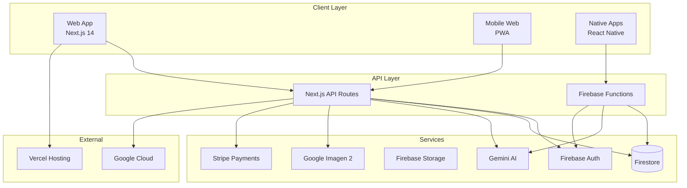
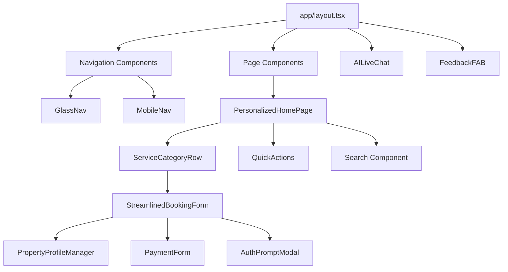
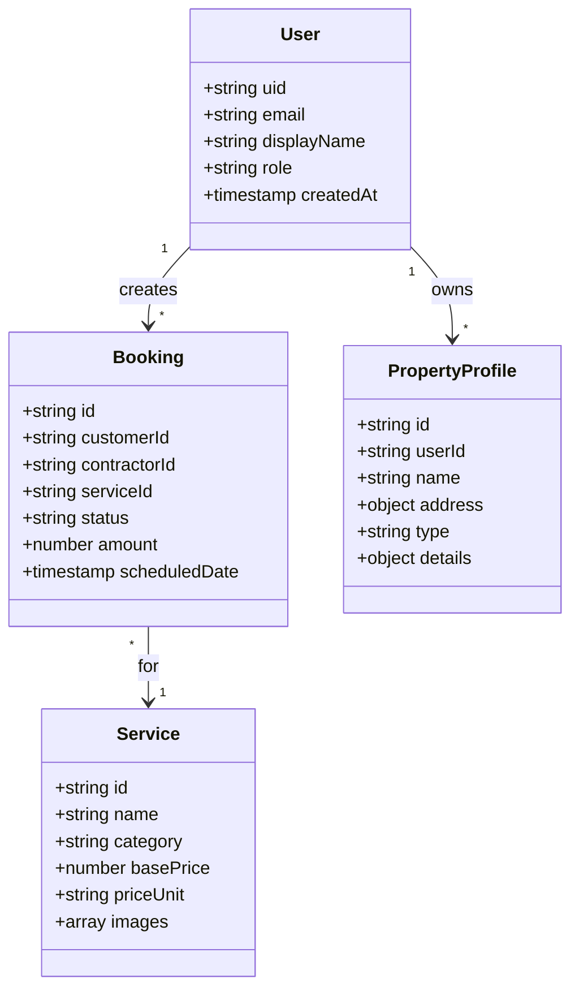
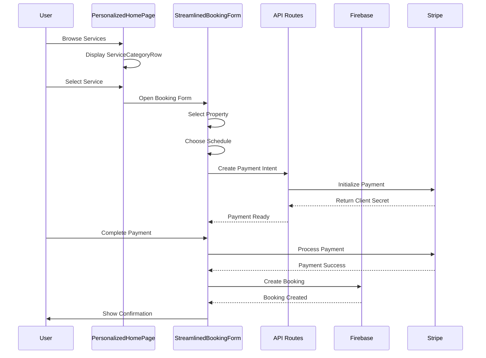
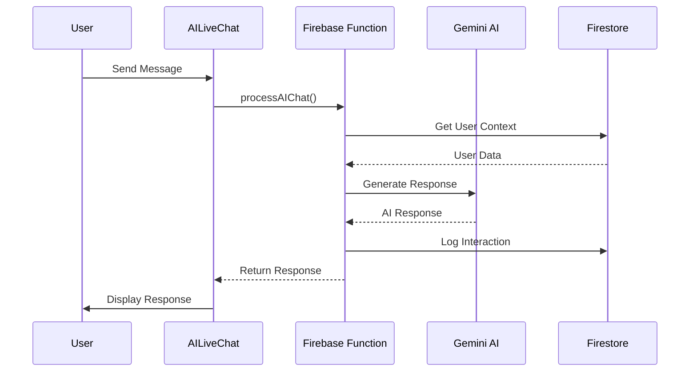
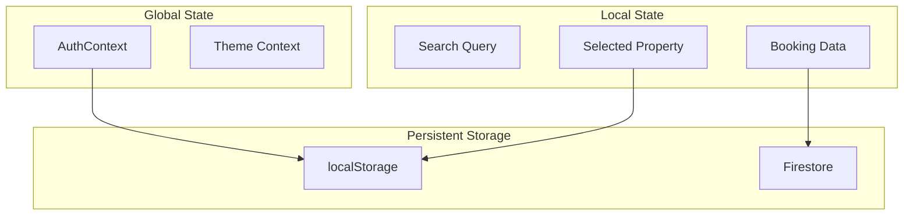
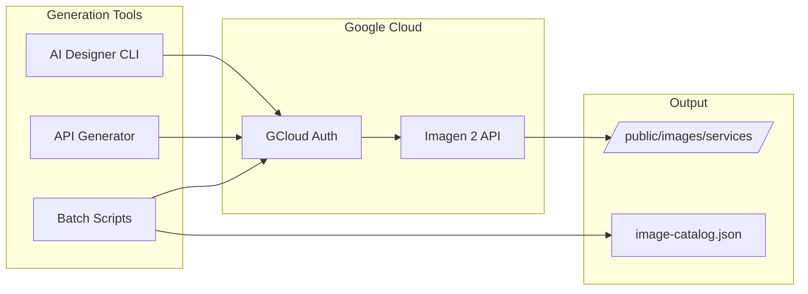
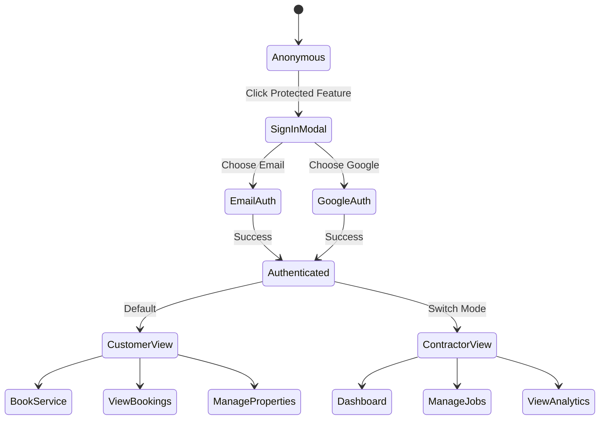

# Leila Home Service Platform - Architecture Documentation

## Table of Contents
1. [System Overview](#system-overview)
2. [Frontend Architecture](#frontend-architecture)
3. [Backend Architecture](#backend-architecture)
4. [Data Flow](#data-flow)
5. [Component Hierarchy](#component-hierarchy)
6. [API Structure](#api-structure)
7. [Authentication Flow](#authentication-flow)
8. [Image Generation Pipeline](#image-generation-pipeline)

## System Overview



## Frontend Architecture

### Page Structure
```mermaid
graph TD
    subgraph "Public Pages"
        HOME[/ - Home Page<br/>PersonalizedHomePage]
        SERVICES[/services/* - Service Details]
        HOW[/how-it-works - How It Works]
        ERROR404[404 Pages]
    end
    
    subgraph "Contractor Pages"
        CDASH[/contractor/dashboard]
        CPROFILE[/contractor/profile]
        CSIGNUP[/contractor/signup]
        CLOGIN[/contractor/login]
    end
    
    subgraph "Admin Pages"
        CRM[/admin/crm/*]
        CUSTOMERS[/admin/crm/customers]
        CONTRACTORS[/admin/crm/contractors]
        BOOKINGS[/admin/crm/bookings]
        AI_ACTIVITY[/admin/crm/ai-activity]
    end
```

### Component Hierarchy


## Backend Architecture

### API Routes Structure
```mermaid
graph LR
    subgraph "API Routes (/app/api)"
        AI[/ai/chat - Gemini Chat API]
        ASSET[/generate-asset - Image Generation]
        PAYMENT[/create-payment-intent - Stripe]
    end
    
    subgraph "Firebase Functions"
        PROCESS_CHAT[processAIChat]
        PROCESS_FEEDBACK[processFeedback]
        USER_INTEL[userIntelligence]
    end
```

### Data Models


## Data Flow

### Booking Flow


### AI Chat Flow


## Component Communication

### State Management


## Image Generation Pipeline



## Authentication Flow



## Key Design Decisions

### 1. **Single Source of Truth**
- All service data comes from `comprehensive-services-catalog.ts`
- All images are AI-generated and stored in `/public/images/services/`
- User authentication state managed by Firebase Auth

### 2. **Component Reusability**
- `ServiceCategoryRow` used throughout for service display
- `StreamlinedBookingForm` handles all booking flows
- `AILiveChat` provides consistent chat experience

### 3. **Performance Optimizations**
- Image lazy loading with Next.js Image component
- Code splitting by route
- PWA for offline support

### 4. **Security**
- API keys server-side only (no NEXT_PUBLIC for sensitive data)
- Firebase security rules for data access
- Stripe for secure payment processing

## Maintenance Guidelines

### Adding New Features
1. Check this architecture diagram first
2. Identify if similar functionality exists
3. Reuse existing components when possible
4. Update diagrams after implementation

### Common Pitfalls to Avoid
- ❌ Creating duplicate API endpoints
- ❌ Adding new chat implementations
- ❌ Creating separate booking forms
- ❌ Hardcoding service data
- ❌ Using stock images instead of AI-generated

### Current Status
- ✅ 211+ AI-generated service images
- ✅ Unified booking system
- ✅ Single AI chat implementation
- ✅ Consolidated navigation
- ✅ Removed duplicate components